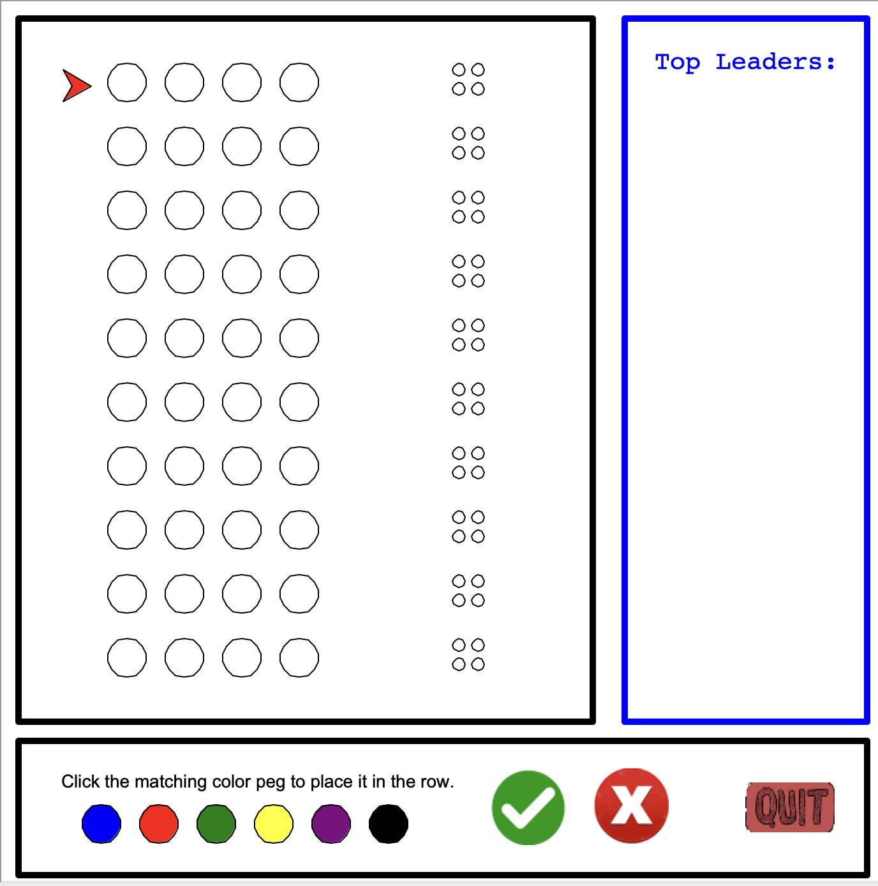

# Mastermind Game

## 简介 (Introduction)
Mastermind Game 是一个基于 Python 的经典猜谜游戏，玩家需要在六个不同的颜色中选出由四种颜色组成的正确组合。

Mastermind Game is a classic puzzle game based on Python, where players need to select four out of six different colors and combine them into the correct color combination.

## 安装 (Installation)
确保您的系统已安装 Python。下载项目后，无需额外安装。

Make sure Python is installed on your system. No additional installation is required after downloading the project.

## 运行 (Usage)
运行主程序：
```bash
python source/mastermind_game.py

## 游戏截图 (Screenshots) 
